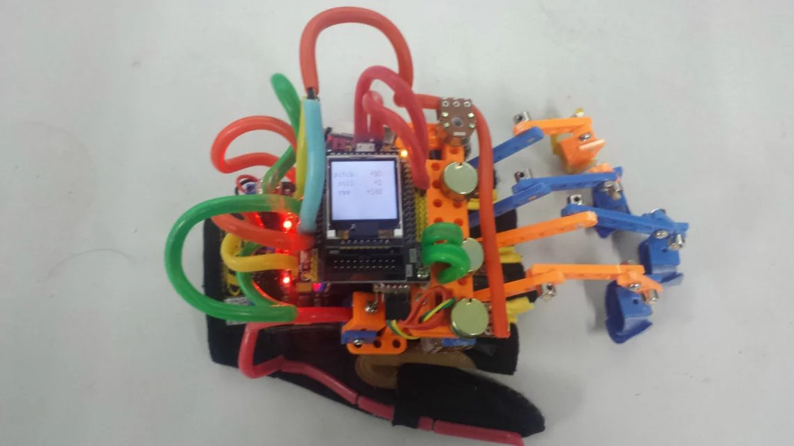
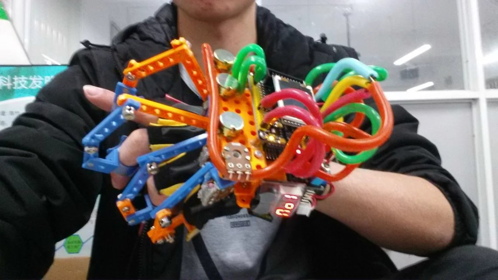

# DigitalGlove
手指运动识别手套，本科毕业设计。

## 简介

手指运动识别手套(版本代号havi-1000)采用stm32f103rct6作为核心处理器，运行ucos-ii操作系统。搭载有电位器、单向弯度传感器、mpu6050对用户手指的运动及整个手掌的姿态进行数据采集。  

用途：采集用户的手指运动以及当前手的姿态，作为输入控制设备通过蓝牙与其他设备进行连接及控制。我的初衷是只给用户提供可进行二次开发的硬件平台，没打算做具体的应用。

## 实际效果演示
1.玩游戏：  
操作系统：Ubuntu 16.04  
游戏： Team Fortress 2  
电脑端的代码在 [这里](./Ubuntu_Control/input_control.py)

2.控制Uarm机械臂：

## 开发环境
1、数据手套：   
操作系统： Win10  
开发语言： C  
编译环境： Kile5  
硬件平台： stm32f103rct6，搭载ucos-ii操作系统

2、电脑游戏控制端：  
操作系统： Ubuntu16.04  
开发语言： python、 shell  
输入设备控制（鼠标、键盘）： xdotool

## 电器件清单
| 器件         | 型号                              | 说明
|-------------|-----------------------------------|------
|stm32        | stm32f103rct6                     | 主控芯片
|电位器        | 500K单/双联电位器                   | 采集手指弯曲程度
|单向弯曲传感器 | FLX-03A（弯曲电阻变化: 10K～20K 欧姆）| 采集拇指弯曲程度
|加速度计和陀螺仪| mpu6050                           | 获取手的姿态，各个旋转轴的角度
|蓝牙          |HC05                               | 作为主设备与从设备进行数据通信，发送传感器数据

## 蓝牙通信协议
数据包格式：(一共34个byte)

|包头 | 功能码 | 包长度 | 包内容（传感器数据）| 校验和 |
|----|-------|-------|------------------|-------|
|1byte|1byte |1byte  |30byte            |1byte

数据包详细定义表：

|名称|符号|长度|说明 |
|---|----|----|----|
|包头|start|1字节|固定为0x88，用于识别一个帧
|功能码|fun|1字节|保留，固定为0xa1
|包长度|len|1字节|包内容的数据长度，30byte
|包内容|data|30字节|包括12个字节的MPU6050和18个字节的电位器数据
|校验和|sum|1字节|包头、功能码、包长度、包内容的总和，用于校验数据是否正确，保证可靠传输
